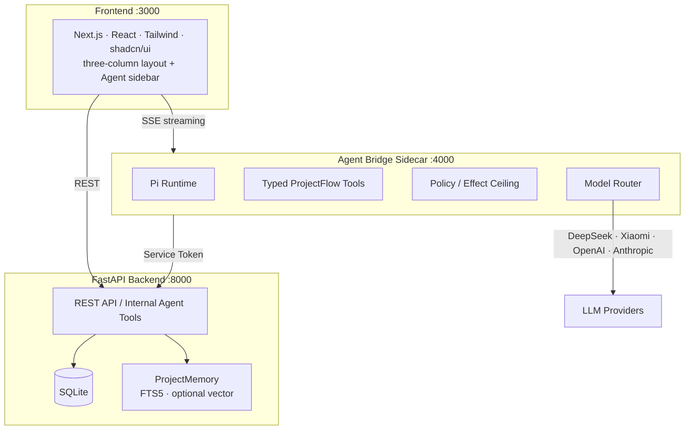

# ProjectFlow

<div align="center">

**A proactive AI Agent for college project teams**

[](docs/handoff.md)
[](https://nextjs.org)
[](https://fastapi.tiangolo.com)
[](https://www.typescriptlang.org)
[](https://www.python.org)
[](https://www.sqlite.org)

</div>

> 📖 **中文文档：[README.zh-CN.md](README.zh-CN.md)**
>
> A traditional task board records tasks; ProjectFlow answers *what's next*.

ProjectFlow is a **proactive AI Agent for college project teams**. Unlike a passive task board, it continuously answers four questions: **Where should the project go? What should we do next? Who is best suited for which task? What is at risk?**

Starting from a vague idea, ProjectFlow clarifies direction, generates stage plans, breaks down tasks, recommends assignments, and — during execution — actively tracks progress, surfaces risks, and adjusts the plan. Every AI suggestion is explainable, confirmable, and reversible: the Agent only proposes, and the final decision always stays with a human.

## ✨ What It Solves

Built for 3–8 person student teams, it turns "keep the project moving" over to a proactive Agent instead of a checklist waiting to be filled in:

| Pain point | What ProjectFlow does |
|------------|-----------------------|
| Don't know where to start | Clarify direction → produce a Direction Card (goal / users / value / boundaries / risks) |
| Don't know how to decompose | Stage planning → task breakdown (priority / dependencies / acceptance criteria) |
| Don't know who does what | Assignment recommendation (skills / availability / preferences / constraints, with reasons) |
| Work drifts off track | Push action cards, track progress, surface risks, replan when needed |

## 🧭 Agent Workflow

The Agent is driven by a deterministic state machine and only produces suggestions at designated nodes, which are persisted only after human confirmation:


## 🏗️ Architecture



**Design principles:**

- **Proposal-Confirm state machine** — the Agent only produces proposals; primary facts (project direction / stages / tasks / assignment ownership) are committed only after human confirmation.
- **FastAPI is the single source of truth** — the Sidecar never touches the business DB directly; all persistence goes through service-token-protected internal contracts.
- **Pluggable models** — a multi-provider registry with dynamic imports supports DeepSeek, Xiaomi MiMo, OpenAI, Anthropic, OpenRouter, and custom OpenAI-compatible endpoints.
- **Local-first** — SQLite with zero configuration works out of the box; the default `mock` model lets you experience the full loop with no API key.

| Layer | Technology |
|-------|------------|
| Frontend | Next.js 16 · React · TypeScript · Tailwind CSS · shadcn/ui · Framer Motion |
| Backend | FastAPI · SQLModel · Pydantic · SQLite |
| Agent | TypeScript Sidecar · Pi component runtime · typed ProjectFlow tools |
| Memory | ProjectMemory (FTS5 + jieba retrieval, optional vector retrieval) |
| Evaluation | In-house Evaluation Lab (deterministic hard graders + 52-scenario Golden Core) |

## 🎯 Key Capabilities

| Capability | What the Agent produces |
|------------|-------------------------|
| **Clarify Direction** | A Direction Card — problem, users, value, deliverables, boundaries, risks |
| **Stage Planning** | Stages with goals, time ranges, deliverables, completion criteria |
| **Task Breakdown** | Tasks with priority (P0/P1/P2), dependencies, acceptance criteria, cut flags |
| **Assignment** | Recommended owner + backup owner + reason, matched against skills / availability / preferences / constraints |
| **Active Push** | Action cards — title, content, reason, target, kickoff suggestion, done criteria |
| **Check-in** | Captures what was done, blockers, available time, confidence; updates task status |
| **Risk Analysis** | Risks typed as deadline / dependency / workload / scope / review / assignment / check-in, each with structured evidence |
| **Replanning** | Before/after diff with impact and rationale; high-impact changes require confirmation |

Every suggestion carries an explicit `reason` for explainability, and the Agent never fabricates members, tasks, or stages.

## 🚀 Quick Start

> Prerequisites: Python 3.11+, Node.js 18+. Repo automation scripts pin Node `24.15.0` / npm `11.12.1`.

### 1. Backend (:8000)

```bash
cd backend
python -m venv .venv
# Windows: .venv\Scripts\Activate.ps1   |   macOS/Linux: source .venv/bin/activate
pip install -e ".[dev]"
python -m uvicorn app.main:app --reload --port 8000
```

The first launch auto-creates the SQLite database. Health check:

```bash
curl http://localhost:8000/api/health
```

### 2. Frontend (:3000)

```bash
cd frontend
npm install
npm run dev
```

Open http://localhost:3000 .

### 3. Agent Bridge Sidecar (:4000, required for real LLM)

Skip this step in mock mode. To get real AI output, start the Sidecar and configure an API key:

```bash
cd agent-bridge
npm install
npx tsx src/index.ts
```

Model config lives in `agent-bridge/model-configs.json` + `agent-bridge/.env` (API keys stay out of JSON and out of Git), or manage it in the UI under **Settings → Model Config**.

### 4. Load demo data

With the backend running:

```bash
curl -X POST http://localhost:8000/api/seed/demo
```

This seeds a 6-member student team, a full project, 4 stages, 11 tasks, plus assignment suggestions, check-ins, risks, action cards, and an Agent timeline. Refresh the frontend to enter the demo project.

> For step-by-step setup, real-LLM configuration, and troubleshooting, see [`docs/setup-guide.md`](docs/setup-guide.md).

### Environment variables

| File | Key | Purpose |
|------|-----|---------|
| `backend/.env` | `LLM_PROVIDER` | `mock` (default) / `openai` / `openai-compatible` |
| `backend/.env` | `LLM_API_KEY` · `LLM_BASE_URL` · `LLM_MODEL` | Real LLM endpoint for the legacy single-model path |
| `backend/.env` | `INTERNAL_SERVICE_TOKEN` | Bearer token for internal Agent-tools/runs endpoints |
| `agent-bridge/.env` | `DEEPSEEK_API_KEY` · `XIAOMI_API_KEY` · … | Provider keys referenced by `model-configs.json` |

`INTERNAL_SERVICE_TOKEN` must match between backend and Sidecar. Never commit `.env` or real API keys.

## ✅ Tests & Acceptance Baseline

| Side | Command | Final baseline (2026-07-27) |
|------|---------|------------------------------|
| Backend | `cd backend && .venv\Scripts\python -m pytest app/tests/ -v` | 912 passed / 4 skipped + ruff |
| Agent Bridge | `scripts/project-npm --prefix agent-bridge run test` | 2651 passed + typecheck / build |
| Frontend | `cd frontend && npm run test && npm run lint && npm run build` | 333 passed / 6 skipped + lint / build |

## 📁 Project Structure

```
projectflow/
├── frontend/            # Next.js frontend (components split by business domain)
├── backend/             # FastAPI backend (route / service / model / schema layers)
│   └── app/memory/      # ProjectMemory retrieval + optional vector extension
├── agent-bridge/        # TypeScript Agent Bridge Sidecar (Pi runtime + tool registry)
│   └── src/evaluation/  # T46 Evaluation Lab (hard graders / Golden Core / showcase)
├── docs/                # PRD, tech design, API contract, phase handoffs
├── scripts/             # eval-lab / project-npm unified entrypoints
└── CONTEXT.md           # Agent Runtime domain glossary
```

## 📚 Documentation

| Topic | Docs |
|-------|------|
| Product | [`docs/PRD-ProjectFlow-MVP.md`](docs/PRD-ProjectFlow-MVP.md) · [`docs/project-introduction.md`](docs/project-introduction.md) |
| Tech design | [`docs/TECH-DESIGN.md`](docs/TECH-DESIGN.md) · [`docs/code-wiki.md`](docs/code-wiki.md) |
| API contract | [`docs/api-contract.md`](docs/api-contract.md) |
| Local setup | [`docs/setup-guide.md`](docs/setup-guide.md) |
| Agent architecture | [`docs/T41/`](docs/T41/) · [`docs/adr/`](docs/adr/) · [`CONTEXT.md`](CONTEXT.md) |
| Project memory | [`docs/T42/project-memory-v1-closure.md`](docs/T42/project-memory-v1-closure.md) |
| Evaluation Lab | [`docs/T46/ProjectFlow_Agent_Evaluation_Lab_Spec.md`](docs/T46/ProjectFlow_Agent_Evaluation_Lab_Spec.md) |
| Latest handoff | [`docs/handoff.md`](docs/handoff.md) |

## 🏁 Milestones

- **Phase 0–41** — full MVP loop (account / workspace / project / stage / task / assignment / active push / check-in / risk / replan), plus security hardening, performance optimization, and frontend polish.
- **T41** — Agent Runtime rework: TypeScript Sidecar + Pi runtime + typed tools + Proposal-Confirm commit boundary.
- **T42** — ProjectMemory V1: governed project memory with deterministic extraction, visibility control, retrieval, and Agent context injection.
- **T43** — Agent Harness V2: Outcome Contract, Prompt Kernel, context compaction, Skills V2, checkpoint/resume/steering.
- **T44 / T45** — agent efficiency and model integrity, private multi-conversation history.
- **T46** — Evaluation Lab: a reproducible, trustworthy Agent evaluation loop (deterministic hard graders, 52-scenario Golden Core, evidence archiving and showcase).

Full process and evidence chain: [`CHANGELOG.md`](CHANGELOG.md) and [`docs/handoff.md`](docs/handoff.md).
