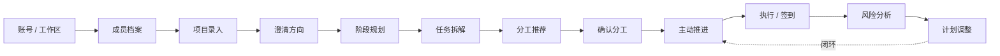
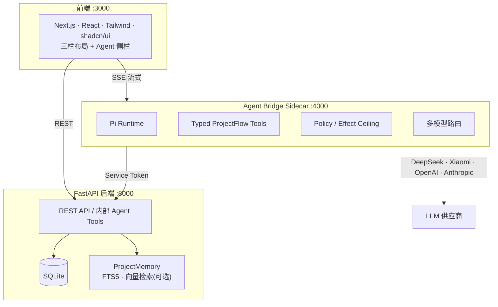

# ProjectFlow

<div align="center">

**面向大学生项目小队的主动推进型 AI Agent**

[](docs/handoff.md)
[](https://nextjs.org)
[](https://fastapi.tiangolo.com)
[](https://www.typescriptlang.org)
[](https://www.python.org)
[](https://www.sqlite.org)

</div>

> 📖 **English version：[README.md](README.md)**
>
> 传统的任务看板负责「记录任务」，ProjectFlow 负责「回答下一步」。

ProjectFlow 是一款**面向大学生项目小队的主动推进型 AI Agent**。与被动记录的任务看板不同，它持续回答四个问题：**项目该往哪走？下一步做什么？谁适合做什么？哪些有风险？**

从一句模糊的想法出发，ProjectFlow 自动澄清方向、生成阶段计划、拆解任务、推荐分工，并在执行过程中主动追踪进度、识别风险、动态调整计划。所有 AI 建议都可解释、可确认、可回退——Agent 只生成建议，最终决定权始终在人手里。

## ✨ 它解决什么

面向 3–8 人的大学生项目小队，把「项目推着往前走」交给一个主动的 Agent，而不是一套被动等待填写的表格：

| 痛点 | ProjectFlow 的做法 |
|------|-------------------|
| 不知道从哪开始 | 澄清方向 → 生成方向卡（目标 / 用户 / 价值 / 边界 / 风险） |
| 不知道拆成什么 | 阶段计划 → 任务分解（优先级 / 依赖 / 验收标准） |
| 不知道谁来做 | 分工推荐（结合技能 / 可用时间 / 意向 / 约束，附理由） |
| 执行中容易脱轨 | 主动推送行动卡，跟踪进度，识别风险，必要时调整计划 |

## 🧭 Agent 工作流

Agent 由一条确定性的状态机驱动，只在指定节点生成建议，经人工确认后才落库：



## 🏗️ 技术架构



**设计原则：**

- **Proposal-Confirm 状态机**——Agent 只生成 proposal，主事实（项目方向 / 阶段 / 任务 / 分工归属）经人工确认后才提交。
- **FastAPI 是唯一事实源**——Sidecar 不直接读写业务库，所有持久化走服务间 Bearer Token 保护的内部契约。
- **模型可插拔**——多供应商注册表 + 动态 import，支持 DeepSeek、Xiaomi MiMo、OpenAI、Anthropic、OpenRouter 及自定义 OpenAI 兼容端点。
- **本地优先**——SQLite 零配置开箱即用；默认 `mock` 模型，无需任何 API Key 即可体验完整闭环。

| 层 | 技术 |
|----|------|
| 前端 | Next.js 16 · React · TypeScript · Tailwind CSS · shadcn/ui · Framer Motion |
| 后端 | FastAPI · SQLModel · Pydantic · SQLite |
| Agent | TypeScript Sidecar · Pi component runtime · typed ProjectFlow tools |
| 记忆 | ProjectMemory（FTS5 + jieba 检索，可选向量检索） |
| 评测 | 自有 Evaluation Lab（确定性 hard graders + Golden Core 52 场景） |

## 🎯 核心能力

| 能力 | Agent 生成什么 |
|------|---------------|
| **澄清方向** | 方向卡——problem / users / value / deliverables / boundaries / risks |
| **阶段规划** | 阶段及其目标、时间范围、交付物、完成标准 |
| **任务拆解** | 任务及优先级（P0/P1/P2）、依赖、验收标准、可砍标记 |
| **分工推荐** | 推荐 owner + 备选 owner + 理由，结合技能 / 可用时间 / 意向 / 约束匹配 |
| **主动推进** | 行动卡——标题、内容、理由、目标、启动建议、完成标准 |
| **签到** | 记录做了什么、卡点、可用时间、信心；更新任务状态 |
| **风险分析** | 风险按 deadline / dependency / workload / scope / review / assignment / checkin 分类，附结构化证据 |
| **计划调整** | before/after 对比 + 影响 + 理由；高影响变更需确认 |

每条建议都携带明确的 `reason` 保证可解释性，Agent 从不编造成员、任务或阶段。

## 🚀 快速开始

> 前置要求：Python 3.11+、Node.js 18+。仓库自动化脚本固定 Node `24.15.0` / npm `11.12.1`。

### 1. 后端（:8000）

```bash
cd backend
python -m venv .venv
# Windows: .venv\Scripts\Activate.ps1   |   macOS/Linux: source .venv/bin/activate
pip install -e ".[dev]"
python -m uvicorn app.main:app --reload --port 8000
```

首次启动会自动创建 SQLite 数据库。健康检查：

```bash
curl http://localhost:8000/api/health
```

### 2. 前端（:3000）

```bash
cd frontend
npm install
npm run dev
```

打开 http://localhost:3000 。

### 3. Agent Bridge Sidecar（:4000，真实 LLM 需要）

Mock 模式下可跳过此步；要体验真实 AI 输出，需启动 Sidecar 并配置 API Key：

```bash
cd agent-bridge
npm install
npx tsx src/index.ts
```

模型配置走 `agent-bridge/model-configs.json` + `agent-bridge/.env`（API Key 不进 JSON、不提交 Git），也可在前端「设置 → 模型配置」里管理。

### 4. 加载演示数据

后端运行状态下：

```bash
curl -X POST http://localhost:8000/api/seed/demo
```

这会创建一个 6 人学生团队、完整项目、4 个阶段、11 个任务，以及分工建议、签到、风险、行动卡和 Agent 时间线。刷新前端即可进入演示项目。

> 完整的分步启动、真实 LLM 配置与常见问题，见 [`docs/setup-guide.md`](docs/setup-guide.md)。

### 环境变量

| 文件 | 键 | 用途 |
|------|-----|------|
| `backend/.env` | `LLM_PROVIDER` | `mock`（默认）/ `openai` / `openai-compatible` |
| `backend/.env` | `LLM_API_KEY` · `LLM_BASE_URL` · `LLM_MODEL` | 旧版单模型路径的真实 LLM 端点 |
| `backend/.env` | `INTERNAL_SERVICE_TOKEN` | 内部 Agent-tools/runs 端点的 Bearer token |
| `agent-bridge/.env` | `DEEPSEEK_API_KEY` · `XIAOMI_API_KEY` · … | `model-configs.json` 引用的供应商 Key |

`INTERNAL_SERVICE_TOKEN` 需在后端与 Sidecar 间保持一致。切勿提交 `.env` 或真实 API Key。

## ✅ 测试与验收基线

| 端 | 命令 | 结项基线（2026-07-27） |
|----|------|----------------------|
| 后端 | `cd backend && .venv\Scripts\python -m pytest app/tests/ -v` | 912 passed / 4 skipped + ruff |
| Agent Bridge | `scripts/project-npm --prefix agent-bridge run test` | 2651 passed + typecheck / build |
| 前端 | `cd frontend && npm run test && npm run lint && npm run build` | 333 passed / 6 skipped + lint / build |

## 📁 项目结构

```
projectflow/
├── frontend/            # Next.js 前端（按业务领域拆分组件）
├── backend/             # FastAPI 后端（route / service / model / schema 分层）
│   └── app/memory/      # ProjectMemory 检索 + 可选向量扩展
├── agent-bridge/        # TypeScript Agent Bridge Sidecar（Pi runtime + tool registry）
│   └── src/evaluation/  # T46 Evaluation Lab（hard graders / Golden Core / showcase）
├── docs/                # PRD、技术设计、API 契约、各阶段交接文档
├── scripts/             # eval-lab / project-npm 统一入口
└── CONTEXT.md           # Agent Runtime 领域词汇
```

## 📚 文档索引

| 主题 | 文档 |
|------|------|
| 产品定位 | [`docs/PRD-ProjectFlow-MVP.md`](docs/PRD-ProjectFlow-MVP.md) · [`docs/project-introduction.md`](docs/project-introduction.md) |
| 技术设计 | [`docs/TECH-DESIGN.md`](docs/TECH-DESIGN.md) · [`docs/code-wiki.md`](docs/code-wiki.md) |
| API 契约 | [`docs/api-contract.md`](docs/api-contract.md) |
| 本地启动 | [`docs/setup-guide.md`](docs/setup-guide.md) |
| Agent 架构 | [`docs/T41/`](docs/T41/) · [`docs/adr/`](docs/adr/) · [`CONTEXT.md`](CONTEXT.md) |
| 项目记忆 | [`docs/T42/project-memory-v1-closure.md`](docs/T42/project-memory-v1-closure.md) |
| 评测实验室 | [`docs/T46/ProjectFlow_Agent_Evaluation_Lab_Spec.md`](docs/T46/ProjectFlow_Agent_Evaluation_Lab_Spec.md) |
| 最新交接 | [`docs/handoff.md`](docs/handoff.md) |

## 🏁 结项里程碑

- **Phase 0–41**：MVP 全流程闭环（账号 / 工作区 / 项目 / 阶段 / 任务 / 分工 / 主动推进 / 签到 / 风险 / 重排），安全加固、性能优化与前端体验打磨。
- **T41**：Agent Runtime 重构——TypeScript Sidecar + Pi runtime + typed tools + Proposal-Confirm 提交边界。
- **T42**：ProjectMemory V1——治理型项目记忆，确定性抽取、可见性控制、检索与 Agent 上下文注入。
- **T43**：Agent Harness V2——Outcome Contract、Prompt Kernel、上下文压缩、Skills V2、checkpoint/resume/steering。
- **T44 / T45**：Agent 效率与模型完整性、私人多会话历史。
- **T46**：Evaluation Lab——可复现、可信的 Agent 评测闭环（确定性 hard graders、Golden Core 52 场景、证据归档与 showcase）。

完整过程与证据链见 [`CHANGELOG.md`](CHANGELOG.md) 与 [`docs/handoff.md`](docs/handoff.md)。
